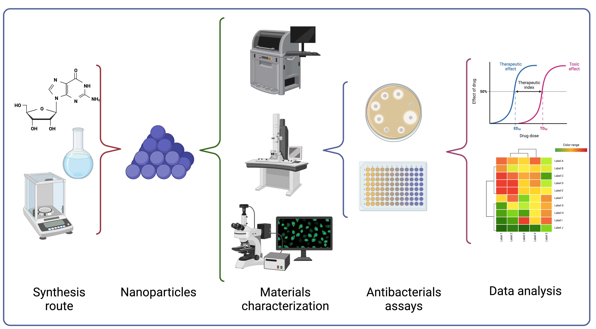

# Research Projects

This are some of the projects in which I am currently working. If you
are interested in any, please drop me a line at my email:
gildardo.sanchez at tec.mx.

=====================================================================

## Nanomaterials Property Modeling and Optimal Experimental Design

The process to generate a new material is long and costly. By using
machine learning it is possible to achieve what is called Optimal
Experimental Design (OED). This approach first generates a model using
available data, then the model is used along with some optimization
technique in order to find the most promising experiments, which will
then be performed at the lab.

In this project, we have been collaborating with the **Nanobiotechnology
group** of Tec de Monterrey, Campus Guadalajara in the modeling of
nanomaterials that are studied as possible antibiotics.

## =====================================================================

## Robot Motion Planning and Machine Learning

Motion planning is a fundamental and essential task for the deployment
of robots in practical applications, and Machine Learning has been
explored to improve the efficiency of motion planning. This happens
mainly by two possibilities:

-   Human-crafted reward functions.

-   Learn feasible solutions from previously successful planning
    experiences.

In this project the main idea is to combine machine learning techniques
to leverage the motion planning capabilities of robots. We have been
using Deep Reinforcement Learning strategies, among other options.

This project is performed in collaboration with Prof. Rafael Murrieta,
from Centro de Investigación en Matemáticas and Dr. Carlos Nieto, from
U.S. Command Army Research Laboratory (ARL).

## =====================================================================

## Water properties modeling with Machine Learning

Water level and streamflow are required to answer many important
hydrological questions such as water distribution, flood and erosion
management, etc. Cameras are cheap and provide a wealth of information
not available with commonly used sensors. In this project, the intention
is to develop machine learning models in order to to fill gaps in sensor
data for when sensors fail or funding is not available to operate the
sensors.

This project is developed in collaboration with the University of
Nebraska-Lincoln.

Past Projects




  

